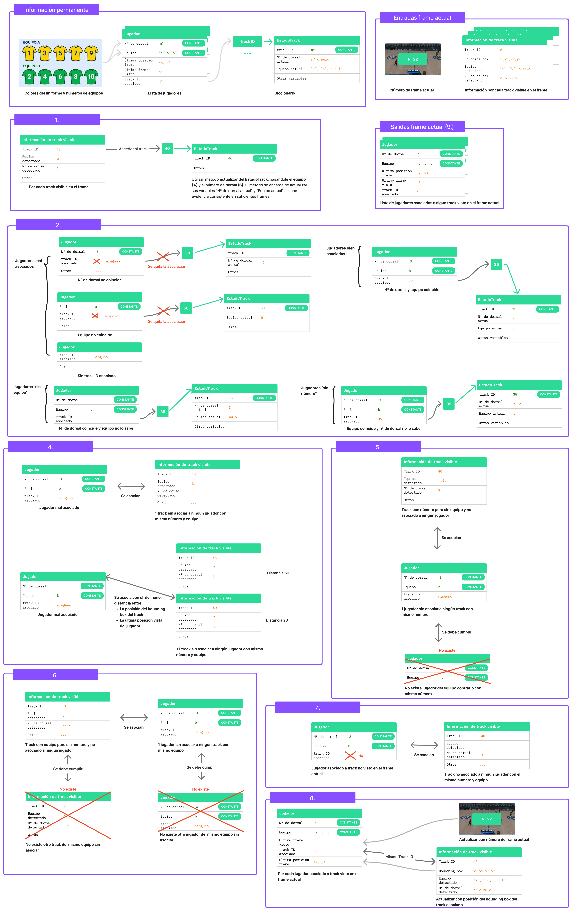

Esta carpeta contiene la lógica de asociación que utiliza la salida del tracker base junto con los dorsales leídos y equipo de cada jugar detectado en el frame actual, y con la última posición conocida de cada jugador, para vincular los tracks temporales con las identidades persistentes de los jugadores cuando existe evidencia suficiente.

## Explicación del código del manejador de jugadores

Para mejorar el entendimiento del sistema, se muestra un esquema de la entrada, salida, información interna, y pasos del manejador de jugadores. Esta clase se encarga de asociar jugadores específicos con un track determinado, utilizando la información de *EstadoTrack*.

### Información permanente
Esta clase guarda la siguiente información de forma permanente:

- **numeros\_jugadores\_A**: Números de los jugadores del equipo A.
- **numeros\_jugadores\_B**: Números de los jugadores del equipo B.
- **jugadores**: Una lista con instancias de la clase *Jugador*, que almacena su información única e identificatoria (número y equipo), y su información temporal (posición en el frame de la última vez que se vio el jugador en el campo, número del último frame en el que se vio, y identificador del tracker asociado actualmente).
- **tracks**: Diccionario que dado un identificador de tracker, devuelve la instancia de *EstadoTrack* correspondiente.

### Entrada
El método de actualización del manejador de jugadores recibe:

- El número del frame actual.
- Los identificadores de tracker vistos en el frame actual.
- Los *bounding boxes* de los tracks.
- Los números de dorsal leídos para cada track en el frame actual. Si no se ha asociado un dorsal o no se ha leído ningún número en este, se introduce *None* para indicar que no se obtiene esta información en el frame actual.
- Los equipos detectados para cada track en el frame actual. Si no se ha asociado ningún equipo (ocurre al inicio del vídeo, antes de que se entrene el modelo de clasificación de equipos), se introduce *None*.
