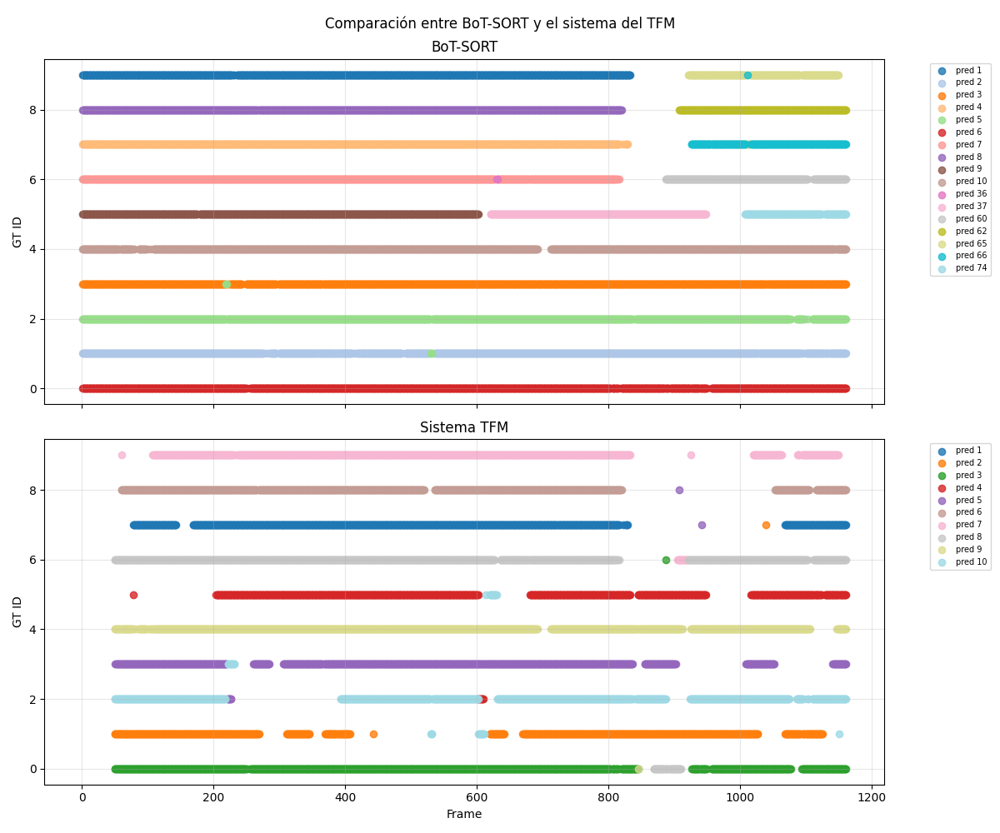
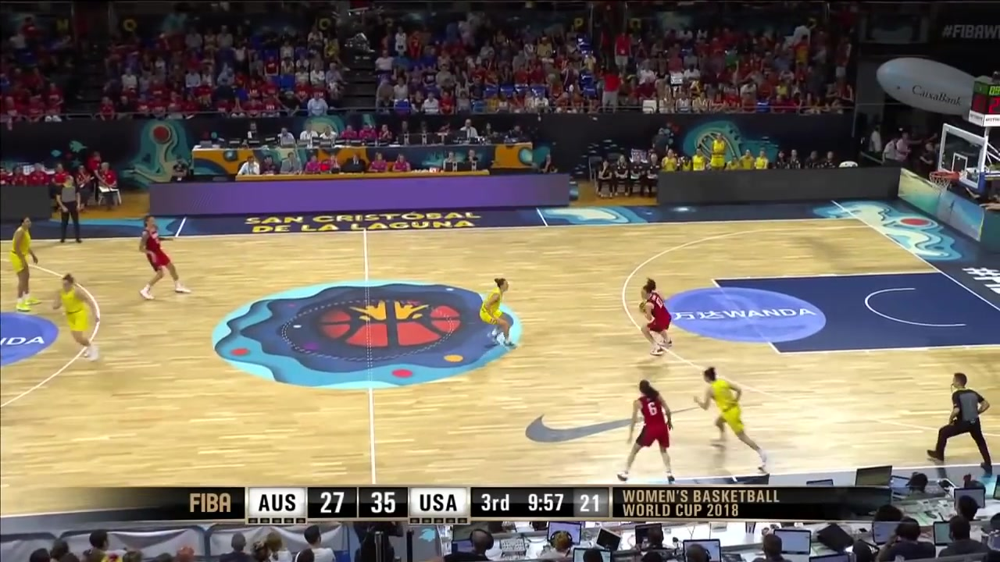
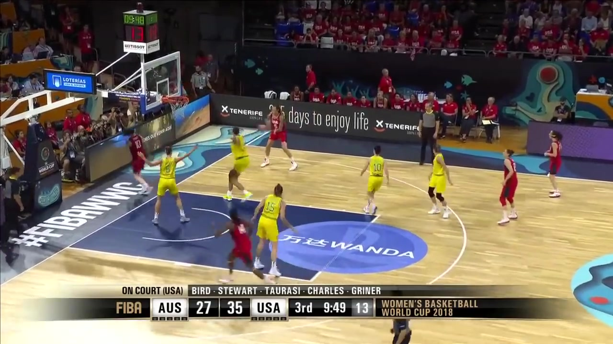

# Resultados y análisis

Este documento presenta los resultados del sistema desarrollado. La evaluación se realiza sobre el conjunto de validación de SportsMOT, utilizado en este trabajo como conjunto de prueba.

En la siguiente tabla se muestran los resultados obtenidos en el sistema y en los trackers utilizados como referencia. Para calcular las métricas del sistema, se realiza la lectura del número de dorsal de los jugadores una vez de cada tres frames, dado que no empeoran las métricas respecto a la lectura en todos los frames, y se reduce el tiempo de ejecución.

| Modelo | IDF1 | AssA | IDTP | IDFN | IDFP | IDSW | IDs creados | FPS |
|---|---:|---:|---:|---:|---:|---:|---:|---:|
| OC-SORT | 60,12 | 41,81 | 69.546 | 49.279 | 42.969 | 540 | 535 | 122,91 |
| Deep OC-SORT | 61,95 | 43,92 | 71.021 | 47.804 | 39.430 | 432 | 408 | 55,22 |
| BoT-SORT | 71,25 | 51,99 | 83.754 | 35.071 | 32.515 | 475 | 462 | 56,03 |
| ByteTrack | 63,17 | 40,91 | 74.190 | 44.635 | 41.861 | 512 | 544 | 124,04 |
| SAM2 | 71,44 | 70,12 | 82.403 | 36.422 | 29.460 | 164 | 134 | 4,66 |
| Sistema propuesto | 69,69 | 55,87 | 66.458 | 52.367 | 5.420 | 290 | 142 | 23,34 |

*Resultados obtenidos en los 15 vídeos del conjunto de validación del dataset SportsMOT. La evaluación incluye 150 identidades reales (GT_IDs)*

Una de las métricas más relevantes es el tiempo de ejecución, dado que el sistema debe ser viable para equipos no profesionales. En este sentido, el sistema desarrollado es más rápido que el tracker SAM2, aunque más lento que los trackers clásicos. El sistema logra un tiempo de ejecución de 23 FPS.

El número de IDSW y IDFP son métricas clave para los objetivos de este trabajo. De este modo, el sistema logra el número más bajo de IDFP, con 5420, seguido por SAM2, que obtiene 29460. 

Respecto a los IDSW, el sistema logra un número de intercambios de identidad de 290, más bajo que los trackers clásicos, aunque más alto que el tracker SAM2, que obtiene 164 IDSW. Conviene recordar que un valor bajo de IDSW no implica necesariamente un mejor resultado. Cuando se reasigna a un jugador el identificador de otro, se produce un IDSW, pero si el sistema es capaz de detectar este intercambio y volver a corregirlo, el número de IDSW aumenta pero la consistencia de identidades a largo plazo mejora.

Estas métricas reflejan la decisión de diseño de priorizar el mantenimiento de identidades consistentes de los jugadores a largo plazo, aunque esto pueda implicar dejar temporalmente algunos sin una identidad de jugador asignada. Esto se refleja en el número de IDFN, el más alto de la comparativa, con 52367 IDFN, seguido del tracker OC-SORT con 49279 IDFN.

El sistema obtiene menos IDTP, con 66458, respecto a los trackers clásicos, que se situan aproximadamente entre los 70000 y 80000. Esto ocurre por evitar asignar una identidad cuando no existe evidencia suficiente. La reducción de IDTP se acompaña de una disminución considerablemente de IDFP.

Esta comparativa tiene una limitación, dado que se realiza con un conjunto de 15 vídeos, los cuales, si se supone una velocidad de 30 FPS, tienen entre 20 y 40 segundos. El sistema está orientado a recuperar asociaciones de identidad tras una pérdida temporal, una fragmentación o una asociación inconsistente, cuando dispone de evidencia suficiente.

Sin embargo, los vídeos utilizados, al ser tan cortos, no permiten mostrar la mejora a largo plazo, dado que los partidos duran aproximadamente 40 minutos, y aunque se sigan a los jugadores por cuartos en lugar del partido completo, son 10 minutos (sin contar con pausas), que sigue siendo mucho mayor a los 40 segundos como máximo de los vídeos utilizados.

En este sentido, si los trackers evaluados producen un intercambio de identidad por cada vídeo, su impacto en secuencias tan cortas es limitado, pero en un partido completo esto implica una gran fragmentación de identidades, lo que impediría sacar métricas fiables por jugador.

Por último, conviene destacar que 5 de los 15 vídeos del conjunto de validación de SportsMOT pertenecen al mismo partido, en el que uno de los equipos tiene el número de dorsal muy desgastado. Esto hace que el sistema lea el dorsal con menor frecuencia.

## Ejemplo cualitativo del conjunto de validación

En esta sección, se muestra un ejemplo del conjunto de validación de SportsMOT. En este ejemplo, se realiza lo siguiente para asociar las predicciones a las identidades reales en cada frame:

- Se toman las *bounding boxes* de las predicciones y las identidades reales.
- Se calcula el IoU entre cada predicción e identidad real. Si es menor que 0.6 no se asocian. Si es mayor que 0.6, se guarda como posible emparejamiento. Si es mayor que 0.6 y en el frame anterior ya estaban vinculadas, se asocian directamente.
- Se ordenan los posibles emparejamientos por IoU, y se asignan empezando por la asociación con mayor IoU, sin usar la misma predicción o identidad real dos o más veces.
- Se pintan las asociaciones. Para ello, en el eje x aparecen los frames y en el eje y aparecen los ID de las identidades reales. Se asigna un color a cada ID de predicción, y se pinta un punto de ese color en el frame y identidad real correspondiente.

De este modo, se pueden visualizar qué identidades reales se asocian a qué predicciones, y los intercambios de identidad o fragmentaciones.

En la siguiente figura se observa la comparativa entre el tracker BoT-SORT y el sistema desarrollado en el TFM en un vídeo del conjunto de validación de SportsMOT.

<figure style="text-align: center; margin: 1.5em 0;">
  
  <figcaption style="margin-top: 10px; font-size: 0.95em; color: #333;">
    Identidades predichas y reales en el vídeo v_00HRwkvvjtQ_c003 del conjunto de validación de SportsMOT para BoT-SORT y el sistema desarrollado en el TFM.
  </figcaption>
</figure>

En este vídeo, el sistema logra mantener la identidad de los jugadores a lo largo del vídeo. En algunos casos, descarta la identidad y vuelve a identificarla más adelante.

Sin embargo, el tracker BoT-SORT produce varias fragmentaciones de identidad. Los identificadores reales 6, 7, 8, y 9 obtienen dos identificadores de predicción diferentes, y el identificador real 5 obtiene tres identificadores diferentes.

Estas fragmentaciones de identidad dificultan el análisis posterior por jugador. En un cuarto del partido, que que dura al menos 10 minutos, una tasa de fragmentación comparable tendría un efecto acumulado mucho mayor. Sin embargo, la evaluación cuantitativa de este trabajo se limita a vídeos de 20-40 segundos, por lo que sería necesaria una validación específica en secuencias largas.

## Limitaciones del sistema

El sistema desarrollado tiene la limitación de que, si un jugador aparece de perfil durante la mayor parte de la secuencia, y no se llega a leer el número del dorsal, no es posible identificarlo de forma individual a partir del dorsal.

Como medida del sistema, si en un equipo todos los jugadores menos uno están identificados y se detecta en el frame un jugador de ese equipo sin dorsal leído, se le asocia la identidad del jugador faltante.

Otra limitación, que se observa en los vídeos del conjunto de validación en los que el sistema se comporta peor, aparece cuando un equipo tiene los números de dorsal muy desgastados. En estos casos, el sistema no lee el dorsal con tanta facilidad como en el resto de partidos, lo que puede provocar que aumente el número de falsos negativos al inicio del partido hasta que consigue leer los dorsales de los jugadores de ese equipo.

A modo de ejemplo, se observa en la siguiente figura, el frame 67 del vídeo v\_5ekaksddqrc\_c001 del conjunto de validación, en el que el equipo con uniformes amarillos tiene los dorsales muy desgastados, y el sistema no es capaz de leerlos. Sin embargo, en el frame 280 del mismo vídeo, el sistema logra leer los dorsales 10 y 15 de ese equipo, y unos frames después, el sistema logra leer el dorsal 6.

<figure style="text-align: center; margin: 1.5em 0;">
  

    

      
      
(a) Frame 67

    

    

      
      
(b) Frame 280

    

  

  <figcaption style="margin-top: 10px; font-size: 0.95em; color: #333;">
    Frames del vídeo v_5ekaksddqrc_c001 del conjunto de validación de SportsMOT
  </figcaption>
</figure>